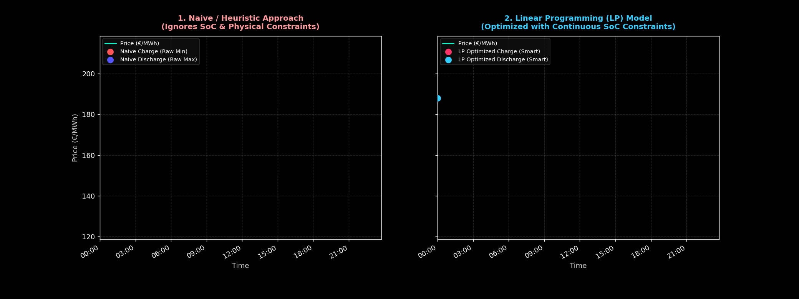

Markdown
# ⚡ German BESS Arbitrage & High-Frequency Price Optimization

A Python-based engineering toolkit designed to analyze **15-minute high-resolution power market data** from the German/Luxembourg (DE/LU) bidding zone (sourced from **SMARD.de**), model Battery Energy Storage Systems (BESS) dispatch strategies, and visualize intraday volatility and arbitrage margins using rigorous mathematical optimization.

---

## ⚖️ Model Comparison: Naive Heuristic vs. Linear Programming (LP)
The animation below contrasts a simplistic peak-shaving heuristic (left) with our rigorous continuous-SoC LP optimization model (right):

<p align="center">
  
</p>

---

## 📊 Visualizing BESS Arbitrage Execution
The animation below demonstrates real-time 15-minute price clearing curves on a highly volatile day, capturing midday solar gluts (sub-zero prices) and evening scarcity spikes:

<p align="center">
  
</p>

---

## 🔋 Advanced BESS Asset Optimization & Arbitrage (DE/LU Market)
This project moves beyond simple data visualization to implement a mathematically rigorous **Linear Programming (LP)** optimization model for Battery Energy Storage Systems (BESS) using 15-minute resolution data from SMARD.de.

### 🚀 Key Features
- **Data Engineering:** Automated pipeline for loading, cleaning, and parsing quarter-hourly German day-ahead electricity prices.
- **Mathematical Optimization (PuLP):** Formulated an LP model respecting physical constraints:
  - **State of Charge (SoC) Continuity:** Tracks energy state dynamically across time steps ($t-1$ to $t$).
  - **Power & Capacity Bounds:** Strictly enforces power limits ($P_{max} = 1\text{ MW}$) and energy capacity bounds ($E_{cap} = 2\text{ MWh}$).
  - **Round-Trip Efficiency:** Accounts for losses via charging and discharging efficiency factors ($\eta = 85\%$).
- **Dark-Mode Visualizations & Animations:** Dynamic multi-panel GIF rendering to visualize charging/discharging dispatch patterns alongside continuous SoC profiles.

### 📊 Results Snapshot
- **Total LP Optimized Arbitrage Profit:** ~2,346 € (across simulated test period)
- **Average Daily Net Profit:** ~213 € / day (for a 1MW / 2MWh asset)

---

## 📈 Market Data Snapshot (DE/LU Bidding Zone)
A quick statistical breakdown of the analyzed quarter-hourly dataset reveals the extreme non-linearities that drive high-frequency battery optimization:

| Metric / Parameter | Value / Range | Operational Impact for BESS |
| :--- | :--- | :--- |
| **Data Resolution** | 15-minute (Quarter-hourly) | Captures sharp ramp rates and intra-hour imbalances |
| **Clearing Price Mean** | ~140.20 €/MWh | Baseline market reference (insufficient for BESS valuation) |
| **Solar Glut Floor (Min)** | **-6.21 €/MWh** | **Smart Charging Zone** (Monetizing negative pricing) |
| **Scarcity Peak (Max)** | **249.92 €/MWh** | **High-Margin Discharging Zone** (Capturing evening spread) |
| **Negative Price Intervals** | 40 periods | High frequency of renewable over-generation windows |

---

## 🗂 Repository Structure
- **Day-ahead_prices_202608180000_202608290000_Quarterhour.csv** : Raw SMARD.de dataset
- **bess_lp_arbitrage_results.csv** : Daily optimized LP profit metrics
- **german_bess_market_arbitrage_animated.gif** : Generated animated execution GIF (Single panel)
- **bess_comparison_naive_vs_lp.gif** : Comparative side-by-side execution GIF (Naive vs. LP)
- **german_power_prices.ipynb** : Full interactive Jupyter Notebook pipeline
- **README.md** : Project documentation

---

## 🚀 Quick Start (Jupyter / Colab)
1. Clone or download the repository.
2. Install required dependencies:
   ```bash
   pip install pandas numpy matplotlib pulp
Open german_power_prices.ipynb in Jupyter Notebook or Google Colab and run the cells to process the dataset and execute the linear programming optimization model.

🛠 Core Tech Stack
Language: Python 3.9+

Data Processing: Pandas, NumPy

Optimization Engine: PuLP (Linear Programming / MILP)

Visualization: Matplotlib, Matplotlib Animation (GIF Engine)

Data Source: SMARD.de (Federal Network Agency of Germany)

📄 License
Distributed under the MIT License. See LICENSE for details.
