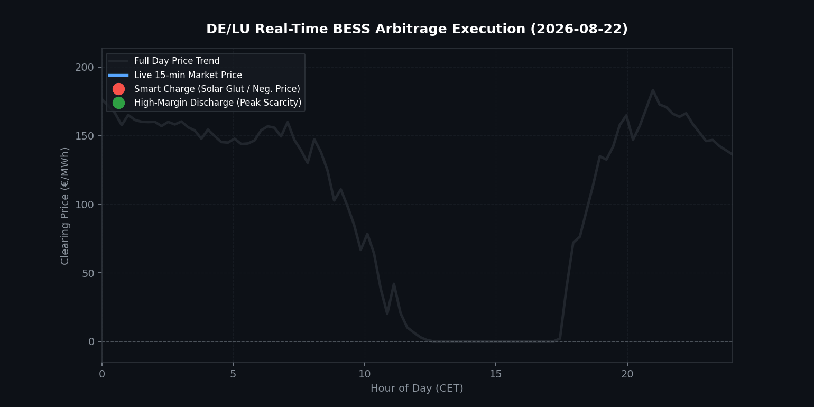

# ⚡ German BESS Arbitrage & High-Frequency Price Optimization

A Python-based engineering toolkit designed to analyze **15-minute high-resolution power market data** from the German/Luxembourg (DE/LU) bidding zone (sourced from **SMARD.de**), model Battery Energy Storage Systems (BESS) dispatch strategies, and visualize intraday volatility and arbitrage margins.

---

## 📊 Visualizing BESS Arbitrage Execution
The animation below demonstrates real-time 15-minute price clearing curves on a highly volatile day (August 22, 2026), capturing midday solar gluts (sub-zero prices) and evening scarcity spikes:

<p align="center">
  
</p>

---

## 📈 Market Data Snapshot (DE/LU Bidding Zone)
A quick statistical breakdown of the analyzed quarter-hourly dataset reveals the extreme non-linearities that drive high-frequency battery optimization:

| Metric / Parameter | Value / Range | Operational Impact for BESS |
| :--- | :--- | :--- |
| **Data Resolution** | 15-minute (Quarter-hourly) | Captures sharp ramp rates and intra-hour imbalances |
| **Clearing Price Mean** | ~140.20 €/MWh | Baseline market reference (insufficient for BESS valuation) |
| **Solar Glut Floor (Min)** | **-6.21 €/MWh** | **Smart Charging Zone** (Monetizing negative pricing) |
| **Scarcity Peak (Max)** | **249.92 €/MWh** | **High-Margin Discharging Zone** (Capturing evening spread) |
| **Negative Price Intervals** | 40 periods | High frequency of renewable over-generation windows |

---

## 🗂 Repository Structure
```text
├── Day-ahead_prices_202608180000_202608290000_Quarterhour.csv  # Raw SMARD.de dataset
├── german_bess_market_arbitrage_animated.gif                     # Generated animated execution GIF
├── german_power_prices.ipynb                                     # Full interactive Jupyter Notebook pipeline
└── README.md                                                     # Project documentation
